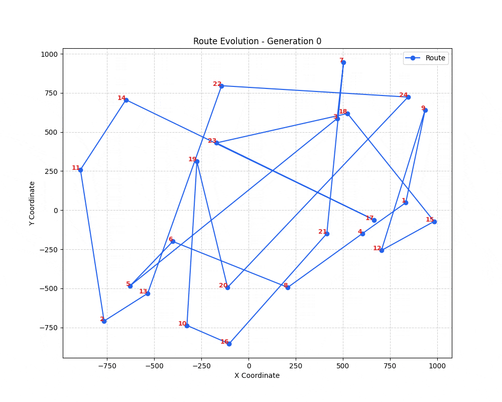

# RouteEvolver 🧬

### Visualizing the Traveling Salesman Problem with Genetic Algorithms

<p align="center">
  
  <br>
  <em>(Above: The algorithm evolving over 150 generations to find the optimal path between 24 cities)</em>
</p>


## 🚀 Overview

**RouteEvolver** is a Python-based visualization tool that solves the NP-Hard Traveling Salesman Problem (TSP) using evolutionary strategies.

I built this project to explore how biologically inspired heuristics—like **natural selection, crossover, and mutation**—can solve complex optimization problems where brute force is computationally impossible.

## 🛠 Tech Stack

* **Python 3.10+** (Core Logic)
* **Matplotlib** (Data Visualization)
* **NumPy** (Math operations)

## 🧬 How it Works

The algorithm mimics the process of natural evolution:

1.  **Initialization:** Creates a random population of routes (DNA).
2.  **Selection (Tournament):** Selects the "fittest" routes (shortest distance) to reproduce.
3.  **Crossover (Two-Point):** Combines parts of two parent routes to create offspring, preserving effective partial paths.
4.  **Mutation (Swap):** Randomly swaps cities in a route to maintain genetic diversity and avoid local optima.

### Algorithm Parameters
* **Population Size:** 100 chromosomes
* **Generations:** 150 iterations
* **Mutation Rate:** 10%
* **Selection Strategy:** Tournament (k=3)

## 📦 How to Run

1.  Clone the repository:
    ```bash
    git clone https://github.com/pabloflow/RouteEvolver.git
    ```
2.  Install dependencies:
    ```bash
    pip install matplotlib
    ```
3.  Run the optimizer:
    ```bash
    python RouteEvolver.py
    ```
    *The script will generate `generation_X.png` files showing the optimization progress.*

## 📈 Results

The algorithm consistently converges from a chaotic initial state (high distance) to a near-optimal circular path, demonstrating the power of heuristic search in combinatorial optimization.

---
*Built by [Pablo Flores](https://www.linkedin.com/in/pablo-flores-moreno-23970a366/). Seeking to build scalable product infrastructure.*